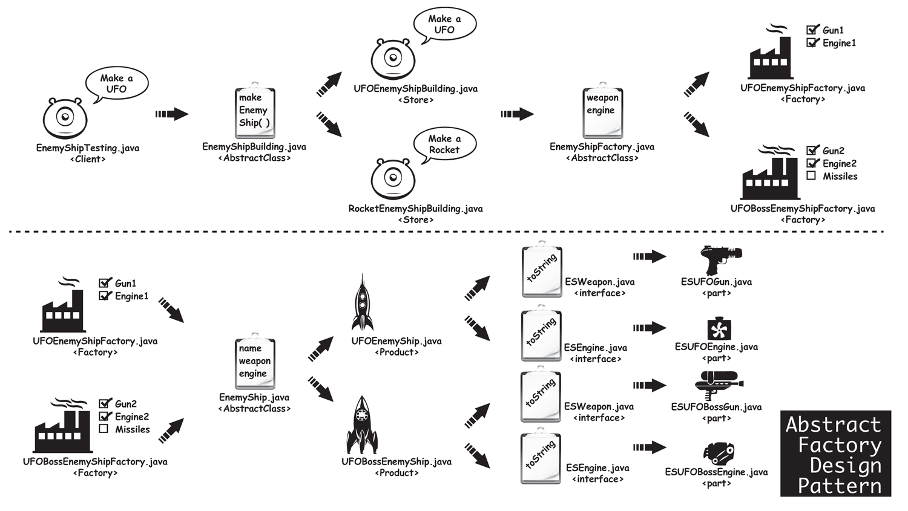

Abstract Factory Pattern
========================

It is like a factory but everything is encapsulated. So, let's start with answering the question 
"What is the difference between Factory Method D.P. and Abstract Factory D.P.?".

Factory Method D.P. aims to realize the production of multiple relational objects with a request to be made through 
a single class via a common interface and to reduce the client's dependency on the produced object to zero at the time 
of object production.

Abstract Factory D.P., on the other hand, provides the production of multiple relational objects not by a single 
interface but by defining a different interface for each product family.

In other words, in cases where we have to work with more than one product family, Abstract Factory D.P. will be the 
right approach to abstract the client from these structures.

Translated with DeepL.com (free version)

