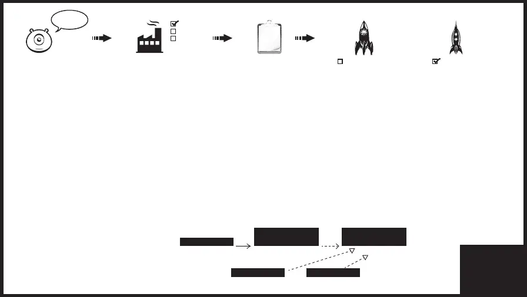

Factory Design Pattern: 
=======================

Factory Design Pattern is a creational design pattern that provides an interface for creating objects in a superclass, 
but allows subclasses to alter the type of objects that will be created.

Instantiation: It is the process of creating an instance of a class. 

The feature of the factory method is to produce the appropriate product
according to the request from the client and give it back to the client. 
For a single class and method to handle this, we need a polymorphic type. 
So a parent class and subclasses derived from this parent class. 
That's why products are designed to have an ancestor as an interface. 

