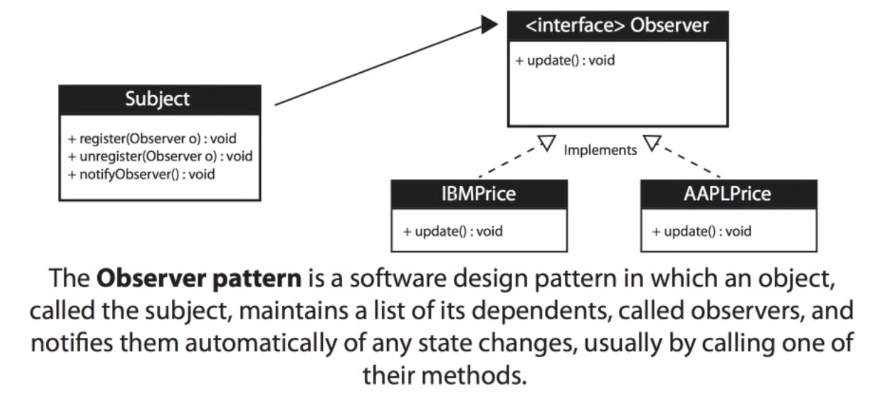

Loose coupling: The publisher doesn't need to know anything about the Observer

Negatives: The Observer can be notified of changes it doesn't care about

Observer Pattern: Defines a one-to-many dependency between objects so that when one object changes state, all of its dependents are notified and updated automatically.

Subject: Knows its observers. Any number of Observer objects may observe a subject.

Observer: Provides an update interface for objects that need to be notified of a Subject's changes of state.

