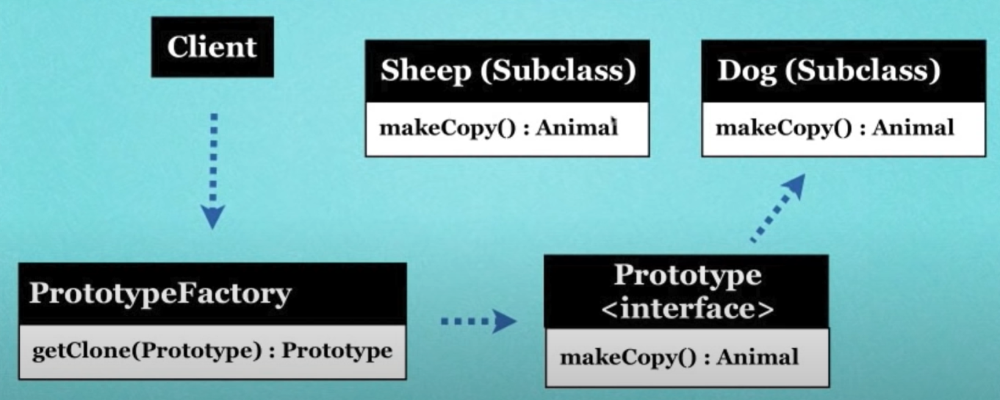

What is the Prototype Pattern?

* Creating new objects (instances) by cloning (copying) other objects.
* Allows for adding of any subclass instance of a known super class at run time.
* Reduces the need for creating subclasses.

Real world example?

* Drawing application where you can copy existing shapes instead of creating new ones.
* Copying is faster than creating.
* Avoids expensive creation.

Since creating objects with the new operator has a cost, it is one of the design patterns that aims to
reduce this cost. In fact, there is no need to make the prototype design pattern too complicated. 
What the prototype design pattern tells us is that if you have an object and you have to create an 
exact copy of this object many more times, don't create it from scratch, instead take clones of the 
object you have. So as the name suggests, an object becomes a prototype. Other objects are created 
based on this prototype. The nice thing is that most frameworks provide us with ready-made functions 
to get a clone of an object. This means that we don't need to write a lot of code when implementing 
the prototype design pattern.

