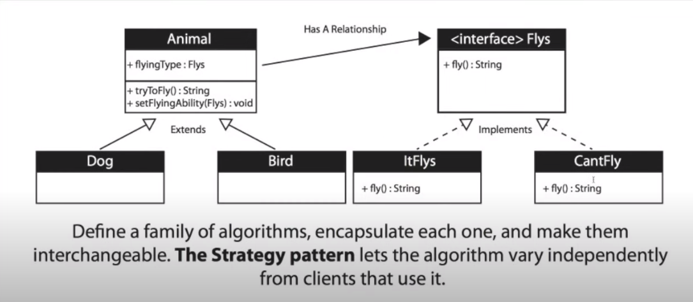

Strategy Design Pattern: Defines a family of algorithms, encapsulates each one, and makes them interchangeable. 
Strategy lets the algorithm vary independently from clients that use it.

Example: Animal class, Dog, Bird, etc. are all subclasses of Animal. Each subclass has a different implementation of the fly() method.
It doesnt't use inheritance, but composition. The Animal class has a Flys interface that is used to call the fly() method.

It is an accepted type of design based on the Open-Closed principle, 
which collects the operations that you can do using if-else and 
simplifies its use.

In this way, when a change needs to be made, we only work with our 
related class instead of reviewing the entire code.

Context: Our wrapper structure that provides convenience for the 
transfer object we will create

Strategy: A common roof interface object

ConcreteStrategy: Our class to implement each algorithm

